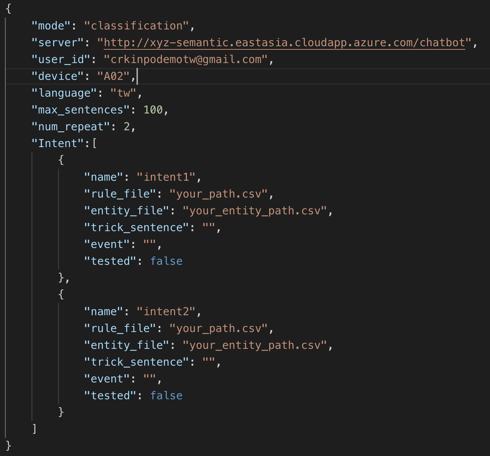

.. _h702e683d32dba581982f6d2e683f:

Project documentation
#####################

.. _h5a2e4148465d783131355b754513803e:

Requirements
************

* python (3.x)

* pyinstaller (3.4 on windows)

* PyQt5 (5.12)

.. _h5323764215142497c6b577361a05b:

Setup
*****

.. _h147947c54da6422576c432562e2:

Install python packages
=======================

.. code:: 

    # install PyQt for user interface.
    $ pip install PyQt5
    
    # install openpyxl to export Excel file.
    $ pip install openpyxl
    
    # install requests to send query to servers.
    $ pip install requests
    

.. _h14456532d775143121f7738247b50:

How-to
******

This chapter introduce how to run semantic checker with terminal. We recommend use this for development.

#. Config JSON file 

    The example file of configuration is following:

\ |IMG1|\ 

    which includes:

* mode: test mode. “classification” or “context.”

* server: URL of server.

* user_id: User account.

* device: A02 or C01.

* language: model language.

* max_sentences: Max sentences checker will retrieve from rule csv file. assign -1 for read all sentences. 

* num_repeat: The number of times to replace @entity@ with real value.

* Intent:

    * name: intent name.

    * rule_file: File path to rule csv file.

    * entity_file: File path to entity csv file.

    * trick_sentence: The sentence can definitely enter this intent.

    * event: event.

    * tested: whether this intent has been tested. If it is True, checker will jump over this intent.

#. Run checker

    Running checker with \ |STYLE0|\ 

.. code:: 

    $ python checker.py

#. Create execution file (.exe) with Pyinstaller on Windows.

    For most of semantic fellow uses Windows, we create execution file on Windows. Before we create Checker execution file, we need to install python and required dependencies on \ |LINK1|\ 

#. Install Pyinstaller on Windows

    After install python on Windows, use pip to install pyinstaller

.. code:: 

    $ pip install pyinstaller

#. Create execution file with Pyinstaller

.. code:: 

    $ pyinstaller ui.py checker.py -F -n Semantic_checker

\ |IMG2|\ 

.. bottom of content

.. |STYLE0| replace:: *checker.py*

.. |LINK1| raw:: html

    <a href="#heading=h.wj4a06xvmweq">Requirements section</a>

